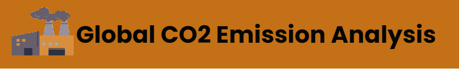

# Project Objective
To conduct a comprehensive analysis of global CO2 emissions spanning from 1970 to 2021 and answer following key questions:

- The annual percent change from 1970 to 2021.
- Trend of global emissions during same period.
- Identify top 5 countries with highest emission in any given year?
- The percentage breakdown of CO2 emission from Coal, Oil and Gas?

To achieve the project objective, I analyzed a comprehensive subset of dataset on global CO2 emissions available on [Kaggle](https://www.kaggle.com/datasets/thedevastator/global-fossil-co2-emissions-by-country-2002-2022). This project involved using Microsoft Excel to analyze the data and derive meaningful insights. The findings of this project have significant implications for policymakers, environmentalists, and other stakeholders concerned with climate change and its impact on the planet. Overall, this project provides a valuable contribution to the field of environmental research by shedding light on global CO2 emissions.

## Process
1. **Data Collection:** 
- Source: https://www.kaggle.com/datasets/thedevastator/global-fossil-co2-emissions-by-country-2002-2022
2. **Data Understanding and Selection:**
- The original dataset contains data from 1750 to 2021. However, for this project I only required data from 1970 to 2021.
3. **Data Cleaning and Modelling:**
- Check duplicates and missing values to ensure data accuracy. None found.
- Check data type for each column.
- Create Pivot tables.
- Use a calculated field feature of pivot table to convert the CO2 emission data from Million tons to Billion tons. 
- Use calculated field to calculate annual percentage change from 1970 to 2021.
- Create a slicer to select year from 1970 to 2021
4. **Data Visualization:**
- Create column chart for annual percent change from 1970 to 2021.
- Create line chart for global emission trend duirng same period
- Create a column chart to identify top 5 countries with highest emisison in any given year
- Create doughnut charts for breakdown of CO2 emission from Coal, Oil and Gas.
5. Storytelling using Dashboard
- Finally bring everything together on a single interface to tell the story.

